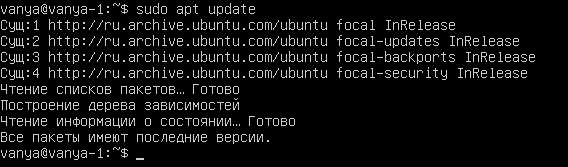
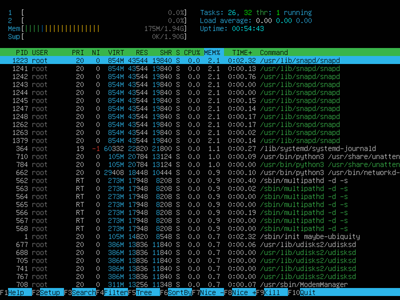

## Part 1. Установка ОС
Вводим команду для проверки актуальной версии программы.

## Part 2. Создание пользователя
Создаем пользователя и помещаем его в группу adm.

## Part 3. Настройка сети ОС
1. Название машины задаем при помощи любого текстового редактора, например vim, необходимо открыть файл `/etc/hostname` и написать туда имя устройства, затем перезагрузить его командой `reboot`
2. Чтобы установить временную зону для системы, необходимо вызвать команду `timedatectl list-timezones`, найти там необходимый часовой пояс и командой `sudo timedatectl set-timezone <your_time_zone>` установить его.
3. Чтобы посмотреть список сетевых интерфейсов воспользуемся командой `ip link show`. Интерфейс `lo` - виртуальный интерфейс, который есть в каждой системе и привязан к адресу 127.0.0.1 (locahost). Используется для отладки приложений и запуска серверных программ на локальной машине.

4. DHCP - протокол динамической настройки узла, который позволяющий устройствам автоматически получать IP и другие параметры для работы в сетях TCP/IP.

5. Вывод внешнего и внутреннего ip-шлюзов.

   

6. Зададим статические ip-адреса при помощи утилиты netplan, а так же после изменения конфига применим команду `sudo netplan apply`, чтобы изменения вступили в силу.
 
7. Перезагружаем и пингуем сервисы, чтобы убедиться что все работает как надо.
## Part 4. Обновление ОС
Обновляем систему до последней версии.

 
## Part 5. Использование команды `sudo`
`Sudo` - программа для делегирование различных привелегированных ресурсов. Суть заключается в том, чтобы дать пользователям права на выполнение каких-либо задач, но не более того.

## Part 6. Установка и настройка службы времени
Проверяем правильно ли настроено время.

## Part 7. Устновка и использование тестовых редакторов
1. Установим текстовые редакторы при помощи пакетного менеджера `apt` командой `sudo apt install <name of pack>`
2. Создание файлов с никнеймом.
    1. `Vim`. Чтобы сохранить изменения и выйти надо нажать `ESC` и ввести комбинацию `:wq` и нажать `Enter`.
    
    2. `Nano`. Чтобы сохранить изменения и выйти надо нажать комбинацию `CTRL+X` и потом нажать `Y`.
    
    3. `MCEDIT`. Чтобы сохранить изменения и выйти надо нажать `ESC` и в диалоговом окне выбрать `YES`.
     
3. Открытие файла, запись в него и сохранение без изменения.
    1. `Vim`. Чтобы выйти без сохранения изменения надо нажать `ESC` и ввести комбинацию `:q!` и нажать `Enter`.
    
    2. `Nano`. Чтобы выйти без сохранения изменения надо нажать комбинацию `CTRL+X` и потом нажать `N`.
    
    3. `MCEDIT`. Чтобы выйти без сохранения изменения надо нажать `ESC` и в диалоговом окне выбрать `NO`.
    
4. Функции поиска слова и его замены на другое.
    1. `Vim`
        1. Чтобы найти слово надо нажать `ESC` потом написать `/` и после этого слово, которое надо найти.
        
        2. Чтобы найти слово и заменить его на другое на воспользоваться командой `:s/{pattern}/{string}`, где `pattern` - слово, которое надо найти, а `string` - строка, на которую надо заменить.
        
    2. `Nano`
        1. Чтобы найти слово надо нажать комбинацию `CTRL+W` и написать слово, которое необходимо найти.
        
        2. Чтобы найти слово и заменить его на другое надо нажать комбинацию `CTRL+\` и сначала написать слово, которое необходимо заменить, потом слово, на которое надо заменить, а потом выбрать: заменить все вхождения, одно или отменить операцию.
         
    3. `MCEDIT`
        1. Чтобы найти слово надо переместить курсор на начало файла, нажать `F7`, написать слово, которое необходимо найти и выбрать `OK`.
        
        2. Чтобы найти слово и заменить его надо переместить курсор на начало файла, нажать `F4`, написать слово, которое надо заменить, и слово, на которое надо заменить, и нажать `OK`, а потом выбрать: заменить все вхождения, одно или отменить операцию.
        

## Part 8. Установка и базовая настройка сервиса `SSHD`
1. Установка службы `SSHD`.

2. Добавление службы в автозапуск.

3. Перенастройка службы на порт 2022.

4. Показать наличие процесса `SSHD`. `ps` - утилита для просмотра информации о процессах. `-A` или `-e` - показывает информацию обо всех запущенных процессах. `-d` - все процессы кроме лидеров сессий. `-p <PID..>` - показывает информацию о конкретных процессах. `-U <username>` - показывает все процессы, выполяемые конкретным пользователем.

5. Перезагрузка и вывод команды `netstat -tan`. `-t` - отображает все TCP соединения. `-a` - отображает все активные соединения. `-n` - отображение всех адресов и портов. `Proto` - название протокола. `Recv-Q` - очередь получения сети. `Send-Q` - сетевая очередь отправки. `Local Address` - локальный адрес и номер порта. `Foreign Address` - адрес удаленного компьютера, к которому подключет сокет, и номер его порта. `State` - статус сокета. `0.0.0.0` - адрес на локальной машине.

## Part 9. Установка и использование утилит `top`, `htop`
1. `top`
    1. Uptime = 0:48
    2. Количество авторизованных пользователей = 1
    3. Общая загрузка системы = 0.00, 0.00, 0.00
    4. Общее количество процессов = 101
    5. Загрузку CPU = 0.0
    6. Загрузка памяти = 1983.2 MiB
    7. PID процесса занимающего больше всего памяти = snapd
    8. PID процесса, занимающего больше всего процессорного времени = top

2. `htop`
    1. Sort by `PID`
    
    2. Sort by `PERCENT_CPU`
    
    3. Sort by `PERCENT_MEM`
    
    4. Sort by `TIME`
    
    5. Filter by `SSHD`
    
    6. `syslog` with search.
    
    7. With `hostname`, `clock` and `uptime` output.
    

## Part 10. Использование утилиты `fdisk`
Название: `VBOX HARDDISK`
Размер: 20 Гб
Количество секторов: 3
Размер `SWAP`: 1.9 Гб
 
## Part 11. Использование утилиты `df`
1. `df`. Size = 10218772 килобайт, Used = 4605604 килобайт, Available = 5072496 килобайт, Use% = 48%
2. `df -Th`. Size = 9.8 G, Used = 4.4 G, Available = 4.9 G, Use% = 48%, Type = ext4

## Part 12. Использование утилиты `du`
1. Запуск `du`. 

2. Вывести размер папок `/home`, `/var`, `/var/log` (в байтах, в человекочитаемом виде).

3. Вывести размер всего содержимого в `/var/log` (не общее, а каждого вложенного элемента, используя *).

## Part 13. Установка и использование утилиты `ncdu`
1. Установка `ncdu`.

2. Размер папки `/home`.

3. Размер папки `/var`.

4. Размер папки `/var/log`.

## Part 14. Работа с системными журналами
1. `cat /var/log/dmesg`
2. `cat /var/log/syslog`
3. `cat /var/log/auth.log`. Время последнего входа: 17:38:10. Пользователь: `admin`. Метод входа: `systemd-logind`.

## Part 15. Использование планировщика заданий `CRON`
1. Используя планировщик заданий, запустите команду uptime через каждые 2 минуты.

2. Удалите все задания из планировщика заданий.

    